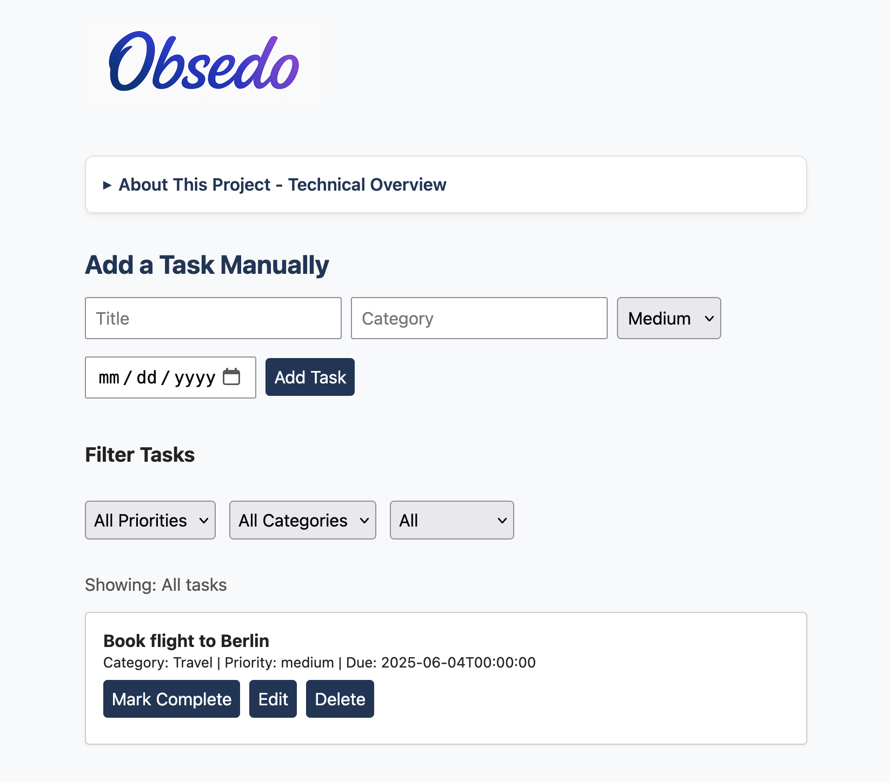

# Obsedo

> "Production-ready task manager with Flask, PostgreSQL, Docker, AWS deployment, and database migrations"

[](http://obsedo.jvlyndark.com)

Obsedo is a fast, clean task manager built from scratch using Python, Flask, Docker, Terraform, and AWS. Designed as a developer portfolio project, it demonstrates backend development, DevOps workflows, infrastructure-as-code, CI, and cloud deployment. OpenAI integration is included as an optional module.

---

### 🛠️ Core Technologies

- **Backend**: Python, Flask, SQLAlchemy, Flask-Migrate
- **DevOps**: Docker, Docker Compose, GitHub Actions
- **Infrastructure**: Terraform, AWS EC2
- **Database**: PostgreSQL (production), SQLite (development)
- **Frontend**: HTML, CSS, Vanilla JS
- **Optional**: OpenAI GPT integration via `.env`

### ✨ Core Features

- Add, view, edit, and delete tasks
- Mark tasks as complete
- Track priority, category, and optional due dates
- Automatic timestamp tracking (created_at, updated_at)
- Professional database migrations for schema management
- Clean interface with real-time updates

---

## 🚀 Getting Started

### Requirements

- Python 3.11+
- Docker & Docker Compose

### Run in Docker

```bash
git clone https://github.com/jvlyndark/obsedo.git
cd obsedo
docker-compose up --build
```

Then visit http://localhost:80 in your browser.

### 💻 Run Locally Without Docker (Development)

For local development with SQLite:

```bash
python3 -m venv venv
source venv/bin/activate
pip install -r requirements.txt

# Run database migrations
DATABASE_URL=sqlite:///obsedo.db flask db upgrade

# Start the app
DATABASE_URL=sqlite:///obsedo.db flask run
```

Visit http://localhost:5000 in your browser.

---

## 🗄️ Database Migrations

This project uses Flask-Migrate for professional database schema management:

### Creating New Migrations

```bash
# After modifying models in app/models.py
DATABASE_URL=sqlite:///obsedo.db flask db migrate -m "Description of changes"
DATABASE_URL=sqlite:///obsedo.db flask db upgrade
```

### Production Deployment

```bash
# Apply migrations in production
flask db upgrade
```

**Key Benefits:**

- Zero-downtime schema changes
- Version-controlled database evolution
- Rollback capability for safe deployments
- Environment-specific configurations (SQLite local, PostgreSQL prod)

---

## 🧩 Roadmap

### Completed ✅

- [x] Add OpenAI-powered task planning
- [x] Add GitHub Actions CI
- [x] Add unit tests for Flask routes
- [x] Deploy with Terraform + AWS
- [x] Add task editing with full CRUD operations
- [x] Add filtering + sorting (priority, category, completion)
- [x] **Database migrations with Flask-Migrate**
- [x] **Automatic timestamp tracking for audit trails**

### In Progress 🚧

- [ ] Client-side support for user-supplied OpenAI keys
- [ ] Responsive UI redesign (mobile & dark mode)

### Under Consideration 💭

- [ ] User authentication
- [ ] Advanced PostgreSQL features for production
- [ ] Serverless deployment for ECS

---

## 🧪 Running Tests

To run tests locally:

```bash
pytest tests/
```

Make sure `pytest` is installed:

```bash
pip install pytest
```

---

## 🔁 GitHub Actions: Lint + Test

Tests and flake8 linting are automatically run on every push. CI is defined in `.github/workflows/ci.yml`.

---

### 🤖 AI-Powered Task Planning (Optional)

Obsedo supports OpenAI integration for automatic task breakdown.

Just enter a goal like:

> "Plan a trip to Berlin"

Obsedo will generate actionable tasks using GPT-3.5.

To enable:

1. Get an [OpenAI API key](https://platform.openai.com/account/api-keys)
2. Set it in your `.env` file:
   ```
   OPENAI_API_KEY=your-key-here
   ```

If no key is set, the feature is disabled gracefully.

---

## ☁️ Deploy to AWS with Terraform

Obsedo is fully deployable to the cloud using:

- **Terraform** for infra-as-code
- **AWS EC2** for hosting
- **Docker Compose** for service management
- **GitHub Actions** for CI/CD (Terraform apply coming soon)

You can find Terraform config under `/infra`.

Deployment spins up an EC2 instance, installs Docker, and launches the app via `docker-compose`.

---

## 🏗️ Architecture Highlights

**Production-Ready Features:**

- Database migration system for safe schema evolution
- Environment-specific configurations
- Containerized deployment with Docker
- Infrastructure-as-Code with Terraform
- Automated testing and linting
- RESTful API design with proper error handling
- Timestamp auditing for data integrity

**Development Workflow:**

- SQLite for local development (zero setup)
- PostgreSQL for production (data integrity)
- Hot-reloading for rapid development
- Comprehensive test coverage

---

## 📄 License

This project is licensed under the MIT License.
See ./LICENSE for details.

---

## ✉️ Contact

#### Ursula J. d'Ark - ursulajdark at gmail dot com

#### Project Link: https://github.com/jvlyndark/obsedo
