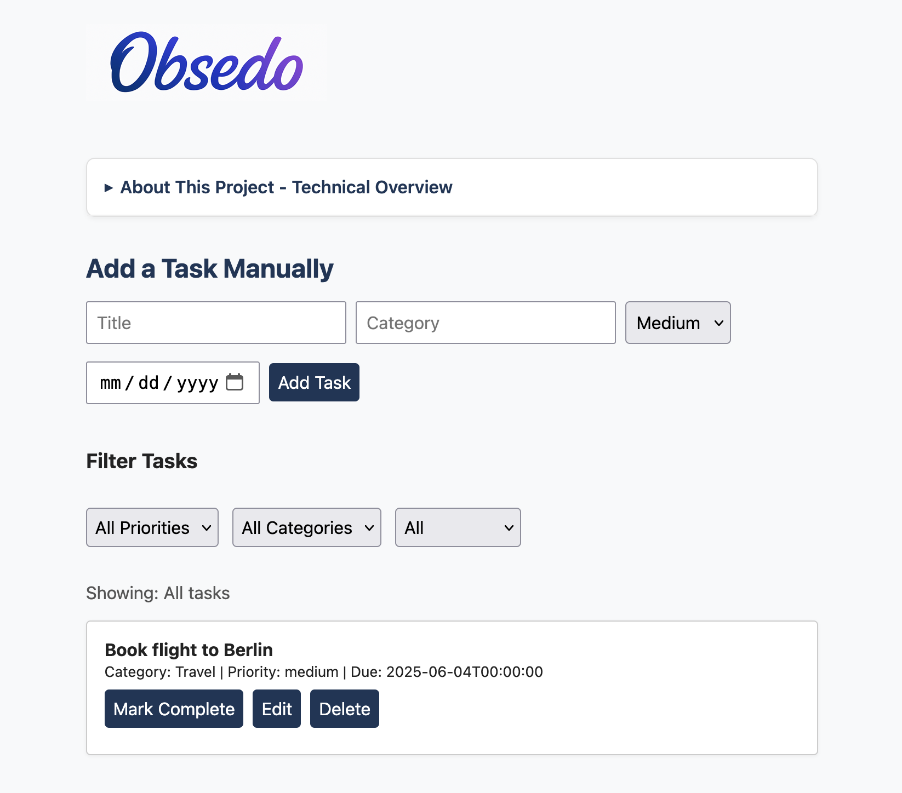
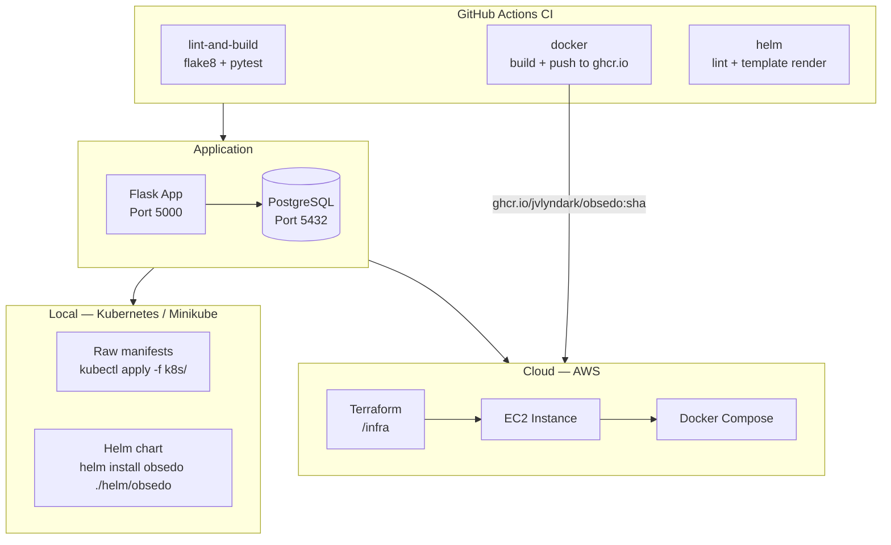

# Obsedo

A portfolio project demonstrating containerised application deployment, infrastructure-as-code, Kubernetes/Helm packaging, and a GitHub Actions CI/CD pipeline — built on a Python/Flask + PostgreSQL backend.

[](http://obsedo.jvlyndark.com)

---

## Stack

| Layer | Technology |
|---|---|
| Backend | Python 3.11, Flask, SQLAlchemy, Flask-Migrate |
| Database | PostgreSQL (production), SQLite (development) |
| Containerisation | Docker, Docker Compose |
| Orchestration | Kubernetes (Minikube), Helm |
| Infrastructure | Terraform, AWS EC2 |
| CI/CD | GitHub Actions, GitHub Container Registry |
| Observability | Prometheus, Grafana |
| Testing | pytest, flake8 |

---

## Architecture


```mermaid
flowchart TD
    subgraph CI ["GitHub Actions CI"]
        lint[lint-and-build\nflake8 + pytest]
        docker_job[docker\nbuild + push to ghcr.io]
        helm_job[helm\nlint + template render]
    end

    subgraph App ["Application"]
        flask[Flask App\nPort 5000]
        pg[(PostgreSQL\nPort 5432)]
        flask --> pg
    end

    subgraph Local ["Local — Kubernetes / Minikube"]
        raw[Raw manifests\nkubectl apply -f k8s/]
        helm_chart[Helm chart\nhelm install obsedo ./helm/obsedo]
    end

    subgraph Cloud ["Cloud — AWS"]
        ec2[EC2 Instance]
        compose[Docker Compose]
        tf[Terraform\n/infra]
        tf --> ec2
        ec2 --> compose
    end

    CI --> App
    App --> Local
    App --> Cloud
    docker_job -->|ghcr.io/jvlyndark/obsedo:sha| Cloud
```

---

## CI/CD

Every push to `main` and every pull request runs three parallel jobs:

| Job | What it does |
|---|---|
| `lint-and-build` | Installs dependencies, runs flake8, builds via Docker Compose |
| `docker` | Builds the image and pushes `ghcr.io/jvlyndark/obsedo:<sha>` (main only) |
| `helm` | Runs `helm lint` and `helm template` to validate the chart |

Images are tagged with the full commit SHA for traceability.

---

## Deployment

### Docker Compose — local development

```bash
git clone https://github.com/jvlyndark/obsedo.git
cd obsedo
docker-compose up --build
```

Visit http://localhost:80.

---

### Kubernetes — raw manifests (Minikube)

```bash
minikube start --driver=docker
eval $(minikube docker-env)
docker build -t obsedo-app:latest .

kubectl apply -f k8s/
kubectl get pods -w
minikube service obsedo-app
```

Manifests are in `k8s/`. Includes a ConfigMap, Secret, PVC, Deployments, and Services.

---

### Kubernetes — Helm (Minikube)

The Helm chart under `helm/obsedo/` exposes image tag, replica count, database credentials, service type, and resource limits as values.

```bash
minikube start --driver=docker
eval $(minikube docker-env)
docker build -t obsedo-app:latest .

helm install obsedo ./helm/obsedo
kubectl get pods -w
minikube service obsedo-app
```

Upgrade with a new image tag:

```bash
docker build -t obsedo-app:v2 .
helm upgrade obsedo ./helm/obsedo --set app.image.tag=v2
```

---

### AWS — Terraform

Infrastructure config is under `/infra`. Terraform provisions an EC2 instance, installs Docker, and launches the app via `docker-compose`.

```bash
cd infra
terraform init
terraform apply
```

---

## Observability

The Flask app exposes a `/metrics` endpoint in Prometheus format, instrumented via `prometheus-client`. Three metric families are recorded on every request:

| Metric | Type | Description |
|---|---|---|
| `flask_http_request_total` | Counter | Request count by method, path, and status code |
| `flask_http_request_duration_seconds` | Histogram | Latency with default buckets |
| `flask_http_request_in_progress` | Gauge | In-flight requests |

When deployed on Kubernetes, Prometheus scrapes `/metrics` every 15 seconds and Grafana is provisioned automatically with a dashboard showing request rate, p50/p95/p99 latency, 5xx error rate, and active in-flight requests.

### Access Grafana on Minikube

```bash
minikube service grafana
```

No login required — anonymous access is enabled for local development. The **Obsedo Overview** dashboard is pre-loaded under **Dashboards** in the left sidebar.

To disable the observability stack (Helm only):

```bash
helm install obsedo ./helm/obsedo --set observability.enabled=false
```

---

## Database Migrations

Schema changes are managed with Flask-Migrate (Alembic):

```bash
# Generate a migration after modifying app/models.py
DATABASE_URL=sqlite:///obsedo.db flask db migrate -m "description"
DATABASE_URL=sqlite:///obsedo.db flask db upgrade

# Apply in production
flask db upgrade
```

---

## Tests

```bash
pytest tests/
```

---

## Notes

- OpenAI integration is included as an optional module (set `OPENAI_API_KEY` in `.env`). If no key is present it disables gracefully.
- Developed with assistance from Claude (Anthropic).

---

## License

MIT. See `LICENSE`.

---

## Contact

Ursula J. d'Ark — ursulajdark at gmail dot com — [github.com/jvlyndark/obsedo](https://github.com/jvlyndark/obsedo)
